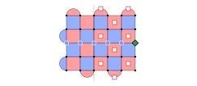
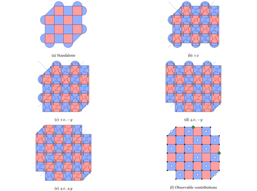
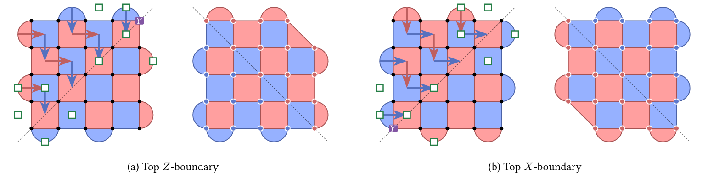
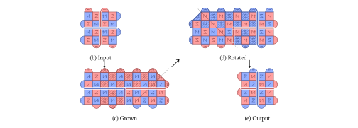

# Circuit Constructions

In this chapter, we introduce the physical circuit realization details of the
blocks and pipes that make compiled programs fault tolerant.

## Pipe

A temporal pipe continues a patch between syndrome rounds, replacing the
preparation and readout at the joined faces. A spatial pipe joins neighboring
patches by lattice surgery: checks extend across the seam, whose data qubits
are prepared at the merge and measured at the split.
First-round stabilizer and split-data outcomes contribute to logical parities
through the connected cubes; temporal connections carry the logical operators
forward.

Hadamard pipes exchange logical X and Z. Their constructions are described in
[Temporal Hadamard](#temporal-hadamard) and [Spatial Hadamard](#spatial-hadamard).

## Regular Cube

A regular cube holds a rotated surface code patch for $d$ syndrome rounds by
default. An isolated patch has $d^2$ data qubits and $d^2-1$ stabilizer ancillas.
[Patch alignment](patch-alignment.md) fixes the checkerboard; boundary faces
select the weight-two checks, while the bulk uses weight-four checks.

An isolated round resets ancillas, applies four CNOT layers, and measures them.
The first round also prepares exposed input data; the last reads exposed output
data. A temporal pipe replaces that preparation or readout with continued QEC.
A spatial pipe merges neighboring patches: seam data is prepared in the first
round and measured at the split in the last.

Horizontal correlation surfaces select first-round stabilizer outcomes between
the patch center and its spatial pipes, giving a joint merge parity. Vertical
surfaces select the central split-data measurement at each seam and, at an
exposed output, the final middle-line data parity.

::::{md-tab-set}
:::{md-tab-item} X correlation
```{bloq-view} regular-observables
:source: examples/viewers/regular-observables.blog
:surface: XX
```
:::
:::{md-tab-item} Z correlation
```{bloq-view} regular-observables
:source: examples/viewers/regular-observables.blog
:surface: ZZ
```
:::
::::

The cube below has a `+X` spatial pipe and a `−Z` temporal pipe. Circles mark
final data measurements, the diamond marks the seam split measurement, and
squares mark first-round stabilizer measurements.



### Examples

::::{md-tab-set}
:::{md-tab-item} Isolated cube
```{bloq-view} regular-zxz
:source: _static/constructions/regular-zxz.blog
```

```{detector-slices} regular-zxz
```
:::
:::{md-tab-item} Temporal connections
```{bloq-view} regular-zxz-isolated-through
:source: _static/constructions/regular-zxz-isolated-through.blog
```

```{detector-slices} regular-zxz-isolated-through
```
:::
:::{md-tab-item} Spatial connection
```{bloq-view} regular-zxz-one-arm-closed
:source: _static/constructions/regular-zxz-one-arm-closed.blog
```

```{detector-slices} regular-zxz-one-arm-closed
```
:::
:::{md-tab-item} Spatial and temporal connections
```{bloq-view} regular-zxz-opposite-arms-through
:source: _static/constructions/regular-zxz-opposite-arms-through.blog
```

```{detector-slices} regular-zxz-opposite-arms-through
```
:::
::::

## Spatial Cube

A spatial cube joins up to four patches for a joint logical measurement.
`ZZX` has Z boundaries in space and prepares and measures data in X; `XXZ`
exchanges these bases. The patch runs $d$ syndrome rounds by default.

Each spatial pipe extends checks across its seam. A missing pipe closes that
edge with weight-two checks; corners can have weight-three checks. The compiler
builds these checks from the full set of connections.

Syndrome rounds use five CNOT layers. Their order varies between quadrants to
keep ancilla faults from creating short logical errors. Regular cubes in the
same component use this schedule too. A straight two-arm junction reduces to
a regular cube with four CNOT layers.

Horizontal correlation surfaces select first-round stabilizers whose product
gives the joint operator on the connected patches. Vertical surfaces select
split-data and final data measurements along the paths between arms. A turn
makes an L-shaped path; the central measurement is included when needed for
commutation.

::::{md-tab-set}
:::{md-tab-item} X correlation
```{bloq-view} spatial-cube-all-spatial
:source: examples/viewers/spatial-cube-all-spatial.blog
:surface: IIXX
```
:::
:::{md-tab-item} Z correlation
```{bloq-view} spatial-cube-all-spatial
:source: examples/viewers/spatial-cube-all-spatial.blog
:surface: ZZZZ
```
:::
::::

Panels (a)–(e) show patches with zero through four arms. Panel (f) marks the
physical records selected by the correlation surfaces. The isolated patch
checks a stabilizer parity without storing a logical qubit.



### Examples

::::{md-tab-set}
:::{md-tab-item} One arm
```{bloq-view} spatial-zzx-one-arm
:source: _static/constructions/spatial-zzx-one-arm.blog
```

```{detector-slices} spatial-zzx-one-arm
```
:::
:::{md-tab-item} Elbow
```{bloq-view} spatial-xxz-elbow
:source: _static/constructions/spatial-xxz-elbow.blog
```

```{detector-slices} spatial-xxz-elbow
```
:::
:::{md-tab-item} Tee
```{bloq-view} spatial-zzx-tee
:source: _static/constructions/spatial-zzx-tee.blog
```

```{detector-slices} spatial-zzx-tee
```
:::
:::{md-tab-item} Cross
```{bloq-view} spatial-zzx-cross
:source: _static/constructions/spatial-zzx-cross.blog
```

```{detector-slices} spatial-zzx-cross
```
:::
::::

## Port

A Port exposes an encoded input or output. Its simulator boundary measures
patch stabilizers with ideal `MPP` operations while leaving the logical state
open. Each Port has one pipe; it does not prepare the resource named by its
interface.

### Temporal Port

A `+Z` pipe from the Port supplies an input to the next block; a `−Z` pipe
receives the preceding block's output. In both cases, the compiler measures
patch stabilizers in one ideal MPP moment. This establishes or closes the
syndrome boundary while preserving the encoded state.
The stabilizer outcomes form boundary detectors; logical X and Z pass through
without additional measurement terms.

### Spatial Port

The compiler places a compatible regular cube at the Port's position,
inheriting its neighbor's height and joining it through lattice surgery.
An ideal temporal boundary supplies the input before this cube for
`role=input`, or exports the output after it for `role=output`.
The virtual boundary occupies no graph cell. Both roles require a single-cell
cube neighbor.
The substituted cube supplies the stabilizer and split-data contributions to
logical parities, while the ideal temporal boundary passes the operators through.

### Multiplex

A spatial `role=multiplex` Port supplies an input and retains a correlated
single-qubit output. The compiler prepares the extra qubit in $|+\rangle$,
measures $Z_L Z_{out}$, and applies $X_{out}$ when the outcome is negative.
It then measures the patch stabilizers as for a spatial input.

The corrected split has $Z_L Z_{out}=+1$. The incoming X operator becomes
$X_L X_{out}$, so its information remains shared between the continuing patch
and the retained output. Both interfaces keep the authored Port coordinate.

(fixed-xz-measurement)=
## Transversal X or Z Measurement

This block runs one closing syndrome round. Its final moment measures ancillas
in their stabilizer bases alongside all data qubits in X or Z. The round
separates readout from a preceding spatial split and checks both stabilizer
bases before collapse. Static compilation includes it even when execution also
waits for a decoder result.

Data readout closes same-basis checks and discards complementary checks. The
logical result combines the middle-line data parity with the records selected
by its correlation surface.

The block receives one past temporal pipe. A separate [measurement action](graphs/actions.md)
names the corrected logical result for later control.

### Padding and nearby observables

Additional syndrome rounds can be needed to preserve observables on other
arms of a spatial split, even when their surfaces do not touch the readout block:

```text
BLOG 1.0

module main {
  0: XXZ [0, 0, 0]
  1: ZXZ [-1, 0, 0]
  2: XZZ [0, 1, 0]
  3: ZXZ [1, 0, 0]
  4: X [1, 0, 1]
  0 -> 1
  0 -> 2
  0 -> 3
  3 -> 4
}
```

The only logical observable, `L0`, is a Z surface on blocks 0, 1, and 2 and pipes
`0 -> 1` and `0 -> 2`, with no support on blocks 3 or 4. At $d=11$, six data
faults and three ancilla hook faults (all X) in block 0, plus one flipped closing
Z-syndrome outcome on the right patch, flip `L0` without triggering a detector.
No data-readout fault is needed: X readout cannot reconstruct Z checks.
Extra syndrome rounds add temporal redundancy, so hiding this chain requires
more faults.

Physical Stim circuits with uniform depolarizing noise at $p=0.001$ give these
graphlike distances. Totals include the closing round; extra rounds are inserted
on pipe `3 -> 4`. Exchanging X and Z gives the same results.

| Requested distance | 1 round | 2 rounds | 3 rounds |
| --- | --- | --- | --- |
| 11 | 10 | 11 | 11 |
| 13 | 12 | 13 | 13 |
| 15 | 13 | 14 | 15 |
| 17 | 15 | 16 | 17 |

Test complete physical circuits at the intended distances; logical or ZX
equivalence alone does not establish fault distance. This example gives no
universal padding rule. Use [memory-round edits](backends/synchronization.md#edit-apis)
on the incoming readout seam; decoder-wait rounds before selective measurements
can also supply the padding.

## Y Initialization and Measurement

A `Y` block prepares logical +Y through a `+Z` pipe or measures logical Y
through a `−Z` pipe.

Readout joins opposite corner twists along a diagonal, deforming the patch
into a degenerate code and measuring the corner in Y. After
$\lfloor d/2\rfloor$ padding rounds, data on one side is measured in X and data
on the other in Z. The logical Y parity combines the corner result with
transition-round ancilla outcomes from two opposite quadrants; the final data
readout closes the remaining stabilizer checks. Initialization reverses this
construction.



### Examples

::::{md-tab-set}
:::{md-tab-item} Prepare Y · ZXZ
```{bloq-view} y-initialization-zxz
:source: _static/constructions/y-initialization-zxz.blog
```

```{detector-slices} y-initialization-zxz
```
:::
:::{md-tab-item} Prepare Y · XZX
```{bloq-view} y-initialization-xzx
:source: _static/constructions/y-initialization-xzx.blog
```

```{detector-slices} y-initialization-xzx
```
:::
:::{md-tab-item} Measure Y · ZXZ
```{bloq-view} y-measurement-zxz
:source: _static/constructions/y-measurement-zxz.blog
```

```{detector-slices} y-measurement-zxz
```
:::
:::{md-tab-item} Measure Y · XZX
```{bloq-view} y-measurement-xzx
:source: _static/constructions/y-measurement-xzx.blog
```

```{detector-slices} y-measurement-xzx
```
:::
::::

## Selective Measurement

A selective measurement chooses between two Pauli bases using an earlier
corrected logical result.

| Kind | True condition | False condition |
| --- | --- | --- |
| `XY` | X | Y |
| `XZ` | X | Z |
| `YZ` | Y | Z |

The X and Z choices use direct [transversal readout](#transversal-x-or-z-measurement).
The Y choice uses the
[twist construction](#y-initialization-and-measurement). Each choice retains
its own circuit and logical readout.
For X or Z, middle-line data outcomes supply the local logical parity. The Y
choice uses the corner and transition-ancilla parity described above.

## T Block

A `T` block prepares a logical magic state on its future temporal face:

$$
|T\rangle=(|0\rangle+e^{i\pi/4}|1\rangle)/\sqrt2.
$$

A physical T seed enters a distance-three color code. Cultivation checks it
with Hadamard tests of $H_{XY}=(X+Y)/\sqrt2$ and rejects failed attempts.
Accepted states escape by lattice surgery into a rotated surface code patch,
then grow to the requested distance. Escape uses distance five, or distance
three when the requested distance is three. The examples show growth from
distance five to distance eleven, followed by stabilization.
Selected merge, color-code data readout, and growth-stabilizer outcomes transport
logical X and Z to the escaped patch and determine its Pauli-frame corrections.

Failed attempts restart without exporting resource records. After success,
the patch completes the configured decoder-latency memory rounds before use.
The cultivation footprint extends beyond one ordinary block cell.

The examples use the Clifford companion of one attempt to display detector
propagation. Actual preparation contains a non-Clifford T gate; the three
escape-merge rounds have distinct circuits. The adjoining cube fixes the pipe's
spatial face bases; its later memory rounds are outside the displayed attempt. See
[T State Cultivation](tutorials/t-cultivation.md) for the experiment and
[Logical T Gate](tutorials/t-gate.md) for use on a data qubit.

### Examples

::::{md-tab-set}
:::{md-tab-item} X/Z spatial faces
```{bloq-view} t-cultivation-and-escape
:source: _static/constructions/t-cultivation-and-escape.blog
```

```{detector-slices} t-cultivation-and-escape
```
:::
:::{md-tab-item} Z/X spatial faces
```{bloq-view} t-cultivation-and-escape-swapped
:source: _static/constructions/t-cultivation-and-escape-swapped.blog
```

```{detector-slices} t-cultivation-and-escape-swapped
```
:::
::::

## Patch Rotation

A patch-rotation block turns the patch boundary orientation by 90 degrees
and moves it one spatial cell. Logical X and Z retain their bases.

The circuit grows the patch, transfers data to the rotated region, then
shrinks to the output patch. The grown and rotated supports each have
$d-2$ intervening syndrome rounds. The CNOT order changes across the diagonal to
control hook errors. Selected stabilizer outcomes from growth and rotated-patch
initialization, together with split-row data readout during shrink, determine
the signs of the transported logical X and Z.



`rotate X` and `rotate Z` connect to one past and one future temporal pipe.
For translation with the same boundary orientation, use [Walking](#walking).

### Examples

::::{md-tab-set}
:::{md-tab-item} rotate X · east
```{bloq-view} rotation-x-east
:source: _static/constructions/rotation-x-east.blog
```

```{detector-slices} rotation-x-east
```
:::
:::{md-tab-item} rotate X · north
```{bloq-view} rotation-x-north
:source: _static/constructions/rotation-x-north.blog
```

```{detector-slices} rotation-x-north
```
:::
:::{md-tab-item} rotate Z · west
```{bloq-view} rotation-z-west
:source: _static/constructions/rotation-z-west.blog
```

```{detector-slices} rotation-z-west
```
:::
:::{md-tab-item} rotate Z · south
```{bloq-view} rotation-z-south
:source: _static/constructions/rotation-z-south.blog
```

```{detector-slices} rotation-z-south
```
:::
::::

## Walking

A walking block translates a patch while preserving its logical state and
boundary orientation. New data enters at the leading edge and trailing data
is measured away, with syndrome extraction throughout.

A slide alternates two diagonal steps to move one spatial cell along an axis.
A glide repeats the same diagonal step. Both use $2(d+1)$ elementary rounds;
each initializes new data, applies four CNOT layers, and measures vacated data.
These rounds have translated supports. Measurements along each step's moving
middle line contribute to logical X/Z parities; final readout also includes
the middle line at the final position.

Temporal pipes attach at the start and end. An exposed endpoint provides
preparation or readout. The examples display one elementary round of the
complete motion.

### Examples

::::{md-tab-set}
:::{md-tab-item} ZXZ slide
```{bloq-view} walking-zxz-slide-east
:source: _static/constructions/walking-zxz-slide-east.blog
```

```{detector-slices} walking-zxz-slide-east
```
:::
:::{md-tab-item} ZXZ glide
```{bloq-view} walking-zxz-glide-northeast
:source: _static/constructions/walking-zxz-glide-northeast.blog
```

```{detector-slices} walking-zxz-glide-northeast
```
:::
:::{md-tab-item} XZX slide
```{bloq-view} walking-xzx-slide-west
:source: _static/constructions/walking-xzx-slide-west.blog
```

```{detector-slices} walking-xzx-slide-west
```
:::
:::{md-tab-item} XZX glide
```{bloq-view} walking-xzx-glide-northwest
:source: _static/constructions/walking-xzx-glide-northwest.blog
```

```{detector-slices} walking-xzx-glide-northwest
```
:::
::::

## Temporal Hadamard

A temporal Hadamard pipe applies H to the logical patch in place. One modified
syndrome round realigns the stabilizers, followed by transversal H on the
data and ancilla readout.

The centered logical strings retain their support and exchange basis:
$X\mapsto Z$, $Z\mapsto X$, and $Y\mapsto-Y$. Each logical X/Z parity includes
at most one boundary ancilla outcome, depending on the patch orientation and
distance. The other ancilla outcomes form stabilizer detectors.

### Examples

::::{md-tab-set}
:::{md-tab-item} ZXZ → XZX
```{bloq-view} temporal-hadamard-zxz
:source: _static/constructions/temporal-hadamard-zxz.blog
```

```{detector-slices} temporal-hadamard-zxz
```
:::
:::{md-tab-item} XZX → ZXZ
```{bloq-view} temporal-hadamard-xzx
:source: _static/constructions/temporal-hadamard-xzx.blog
```

```{detector-slices} temporal-hadamard-xzx
```
:::
::::

## Spatial Hadamard

A spatial Hadamard pipe joins neighboring cubes across a domain wall that
exchanges logical X and Z.

Stretched checks use both CX and CZ gates across the wall. The connected
component uses six entangling layers per syndrome round, alternating their
direction between rounds. Each connected component has one wall axis per
spatial layer; separate components can use different axes.
For surfaces closed by initialization, selected first-round wall-check outcomes
contribute to the logical parity. Final data readout contributes through the
neighboring cubes.

### Distance boundary

:::{important}
This construction can reduce circuit distance. In one crossing fixture,
requested distance five gives graphlike distance four. Prefer a
[Temporal Hadamard](#temporal-hadamard) or a different layout when preserving
distance is required.
:::

### Examples

::::{md-tab-set}
:::{md-tab-item} +X · ZXZ → XZX
```{bloq-view} spatial-hadamard-x-zxz
:source: _static/constructions/spatial-hadamard-x-zxz.blog
```

```{detector-slices} spatial-hadamard-x-zxz
```
:::
:::{md-tab-item} +Y · ZXZ → XZX
```{bloq-view} spatial-hadamard-y-zxz
:source: _static/constructions/spatial-hadamard-y-zxz.blog
```

```{detector-slices} spatial-hadamard-y-zxz
```
:::
:::{md-tab-item} +X · XZX → ZXZ
```{bloq-view} spatial-hadamard-x-xzx
:source: _static/constructions/spatial-hadamard-x-xzx.blog
```

```{detector-slices} spatial-hadamard-x-xzx
```
:::
:::{md-tab-item} +Y · XZX → ZXZ
```{bloq-view} spatial-hadamard-y-xzx
:source: _static/constructions/spatial-hadamard-y-xzx.blog
```

```{detector-slices} spatial-hadamard-y-xzx
```
:::
::::

## Memory Padding

Memory padding adds the same syndrome extraction rounds as a
[regular cube](#regular-cube), keeping the patch protected while it waits for
other operations or classical results.
Ancilla outcomes form detector checks; the logical operators pass through
unchanged.
