# Examples

Here we show the construction of some compilable surface code computations.

```{raw} html
<div class="bloq-gallery-filters" role="group" aria-label="Gallery category" hidden>
<button type="button" data-category="all" aria-pressed="true">All</button>
<button type="button" data-category="clifford" aria-pressed="false">Clifford</button>
<button type="button" data-category="non_clifford" aria-pressed="false">Non-Clifford</button>
<button type="button" data-category="factory" aria-pressed="false">Factory</button>
<button type="button" data-category="external_resource" aria-pressed="false">External resource</button>
<button type="button" data-category="adaptive" aria-pressed="false">Adaptive</button>
<button type="button" data-category="arithmetic" aria-pressed="false">Arithmetic</button>
<button type="button" data-category="addition" aria-pressed="false">Addition</button>
</div>
<p class="bloq-gallery-count" aria-live="polite"></p>
<div class="bloq-gallery-grid">
<a class="bloq-gallery-card" href="cnot.html" aria-label="CNOT" data-categories="clifford">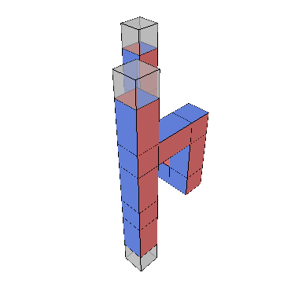<span>CNOT</span></a>
<a class="bloq-gallery-card" href="cz_spatial_h.html" aria-label="CZ with a spatial Hadamard" data-categories="clifford">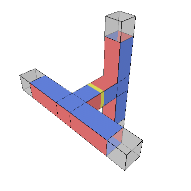<span>CZ with a spatial Hadamard</span></a>
<a class="bloq-gallery-card" href="cz_temporal_h.html" aria-label="CZ with a temporal Hadamard" data-categories="clifford">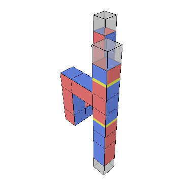<span>CZ with a temporal Hadamard</span></a>
<a class="bloq-gallery-card" href="s_gate.html" aria-label="S gate" data-categories="clifford">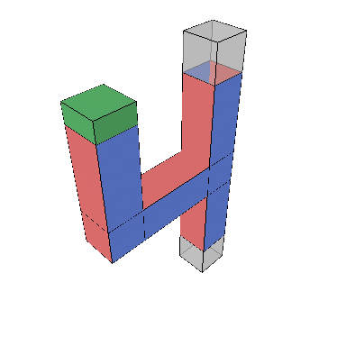<span>S gate</span></a>
<a class="bloq-gallery-card" href="t_gate.html" aria-label="T gate" data-categories="non_clifford">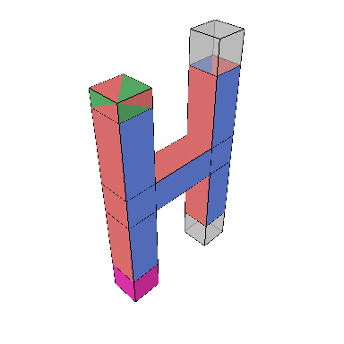<span>T gate</span></a>
<a class="bloq-gallery-card" href="t_with_prepared_y.html" aria-label="T gate with a prepared Y state" data-categories="non_clifford">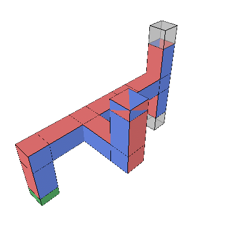<span>T gate with a prepared Y state</span></a>
<a class="bloq-gallery-card" href="t_comparison.html" aria-label="T-state comparison" data-categories="non_clifford">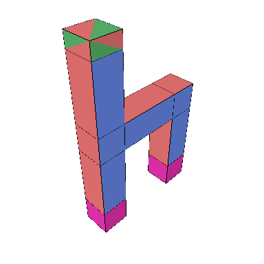<span>T-state comparison</span></a>
<a class="bloq-gallery-card" href="phase_gradient.html" aria-label="Phase-gradient sequence" data-categories="non_clifford">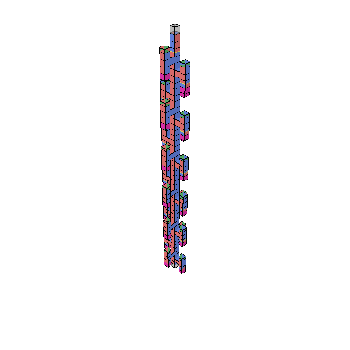<span>Phase-gradient sequence</span></a>
<a class="bloq-gallery-card" href="and_4t.html" aria-label="Four-T AND" data-categories="non_clifford">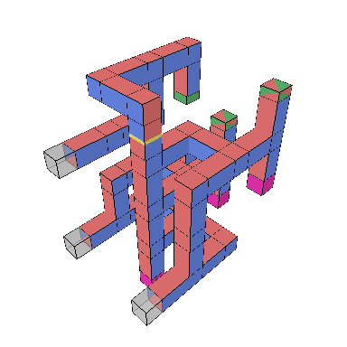<span>Four-T AND</span></a>
<a class="bloq-gallery-card" href="ccz_injected_and.html" aria-label="CCZ-injected AND" data-categories="external_resource non_clifford adaptive arithmetic addition">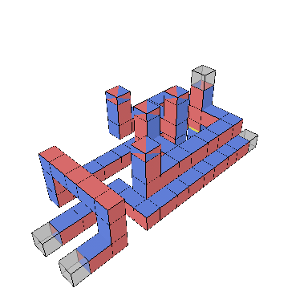<span>CCZ-injected AND</span></a>
<a class="bloq-gallery-card" href="ccz_injected_maj.html" aria-label="CCZ-injected MAJ" data-categories="external_resource non_clifford adaptive arithmetic addition">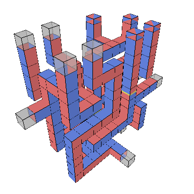<span>CCZ-injected MAJ</span></a>
<a class="bloq-gallery-card" href="uma.html" aria-label="UMA" data-categories="clifford adaptive arithmetic addition">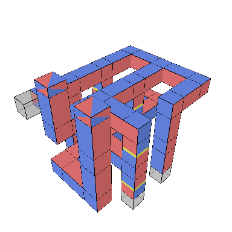<span>UMA</span></a>
<a class="bloq-gallery-card" href="three_bit_adder.html" aria-label="Three-bit controlled adder" data-categories="external_resource non_clifford adaptive arithmetic addition">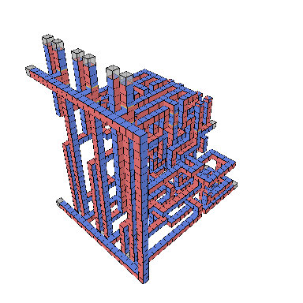<span>Three-bit controlled adder</span></a>
<a class="bloq-gallery-card" href="ten_bit_adder.html" aria-label="Ten-bit controlled adder" data-categories="external_resource non_clifford adaptive arithmetic addition">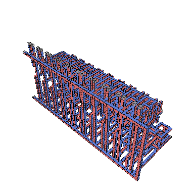<span>Ten-bit controlled adder</span></a>
<a class="bloq-gallery-card" href="toffoli_from_and_delayed_cz.html" aria-label="Toffoli from AND" data-categories="non_clifford">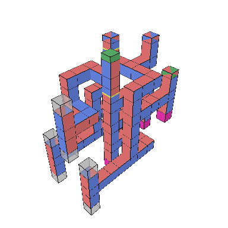<span>Toffoli from AND</span></a>
<a class="bloq-gallery-card" href="ccz_4x3x7_tels.html" aria-label="CCZ factory with TELS" data-categories="factory non_clifford">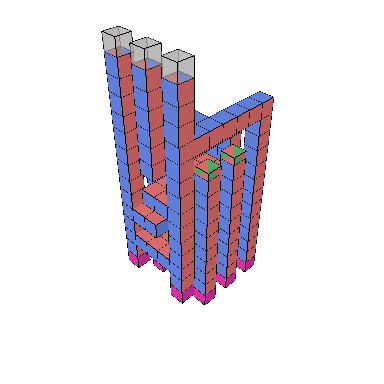<span>CCZ factory with TELS</span></a>
<a class="bloq-gallery-card" href="ccz_4x3x6.html" aria-label="CCZ factory without TELS" data-categories="factory non_clifford">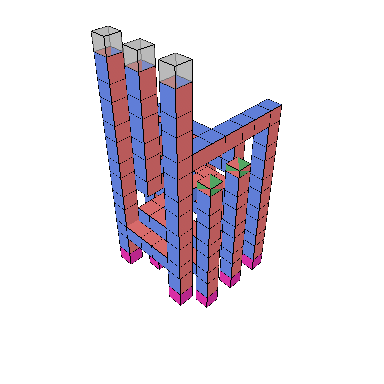<span>CCZ factory without TELS</span></a>
<a class="bloq-gallery-card" href="ccz_gate_teleport.html" aria-label="CCZ gate teleportation" data-categories="external_resource non_clifford">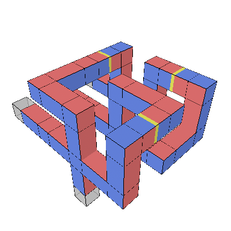<span>CCZ gate teleportation</span></a>
<a class="bloq-gallery-card" href="bell_state.html" aria-label="Bell state" data-categories="clifford">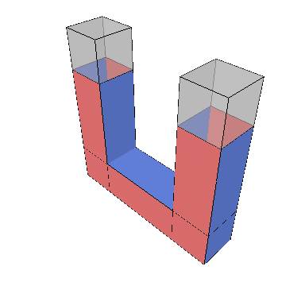<span>Bell state</span></a>
<a class="bloq-gallery-card" href="ghz.html" aria-label="GHZ state" data-categories="clifford">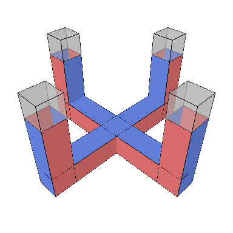<span>GHZ state</span></a>
<a class="bloq-gallery-card" href="ghz_slide_then_glide.html" aria-label="GHZ with slides and glides" data-categories="clifford">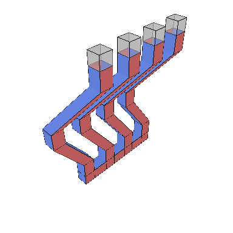<span>GHZ with slides and glides</span></a>
<a class="bloq-gallery-card" href="ghz_patch_rotations.html" aria-label="GHZ with patch rotations" data-categories="clifford">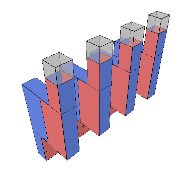<span>GHZ with patch rotations</span></a>
<a class="bloq-gallery-card" href="1d-yoked.html" aria-label="1D yoked layout" data-categories="clifford">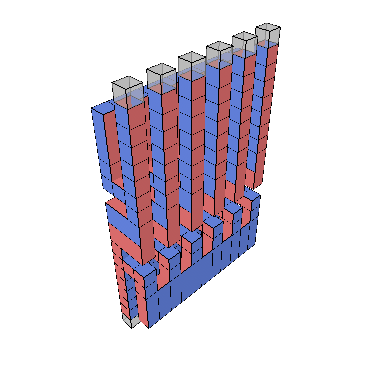<span>1D yoked layout</span></a>
<a class="bloq-gallery-card" href="thth.html" aria-label="T–H–T–H sequence" data-categories="non_clifford">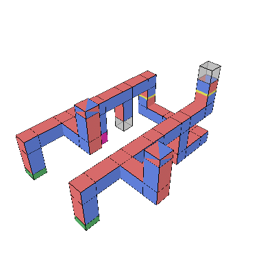<span>T–H–T–H sequence</span></a>
<a class="bloq-gallery-card" href="three_cnots.html" aria-label="Compressed three CNOTs" data-categories="clifford">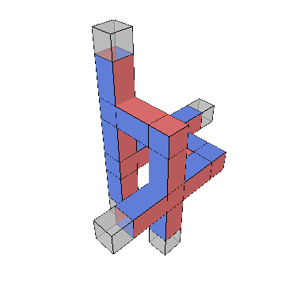<span>Compressed three CNOTs</span></a>
<a class="bloq-gallery-card" href="steane_encoding.html" aria-label="Steane encoding" data-categories="clifford">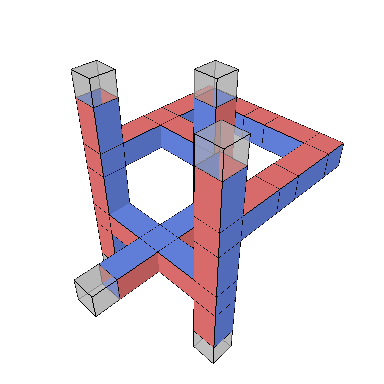<span>Steane encoding</span></a>
<a class="bloq-gallery-card" href="x_memory.html" aria-label="X-basis memory" data-categories="clifford"><span>X-basis memory</span></a>
<a class="bloq-gallery-card" href="y_memory.html" aria-label="Y-basis memory" data-categories="clifford">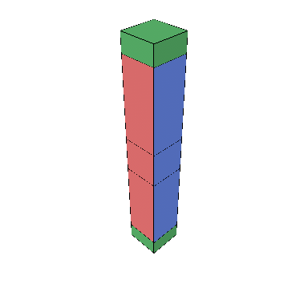<span>Y-basis memory</span></a>
<a class="bloq-gallery-card" href="move_rotation.html" aria-label="Rotation through movement" data-categories="clifford">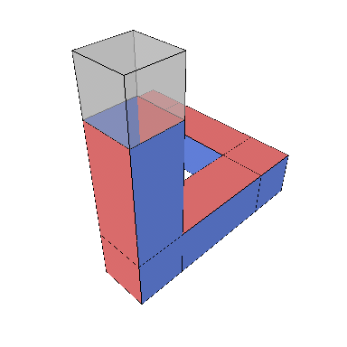<span>Rotation through movement</span></a>
<a class="bloq-gallery-card" href="stability.html" aria-label="Stability experiment" data-categories="clifford">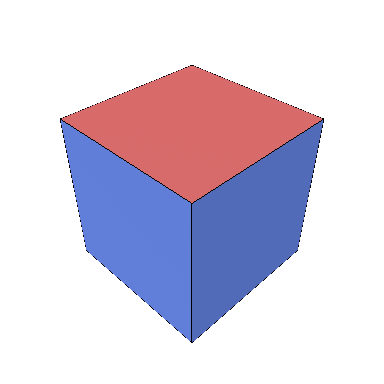<span>Stability experiment</span></a>
</div>
```

```{toctree}
:hidden:
:maxdepth: 1

cnot
cz_spatial_h
cz_temporal_h
s_gate
t_gate
t_with_prepared_y
t_comparison
phase_gradient
and_4t
ccz_injected_and
ccz_injected_maj
uma
three_bit_adder
ten_bit_adder
toffoli_from_and_delayed_cz
ccz_4x3x7_tels
ccz_4x3x6
ccz_gate_teleport
bell_state
ghz
ghz_slide_then_glide
ghz_patch_rotations
1d-yoked
thth
three_cnots
steane_encoding
x_memory
y_memory
move_rotation
stability
```
