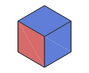
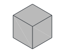
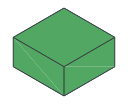
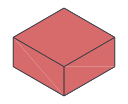
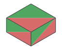
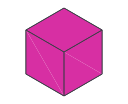
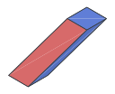
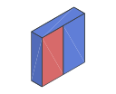
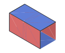

# Blocks and Pipes

A **block graph** describes a logical computation encoded by surface code as a
spacetime layout. **Blocks** represent operations on logical patches, and
**pipes** connect their boundaries: temporal pipes continue a patch through
time, while spatial pipes join patches for lattice surgery.

A block starts at an integer coordinate `[x, y, z]`, with x and y describing
space and z describing time. Its physical spacetime occupation can be larger
or smaller than a $1\times1\times1$ cell. For example, a taller cube spans
several time cells, a Y block takes roughly half a cube's duration, and a moving
block extends across spatial cells. A pipe joins adjacent connectable positions
on the blocks.

## Supported blocks and pipes

Let $d$ be the code distance and $s=2d+2$ the physical lattice pitch of
one block cell. Space occupation counts physical-qubit lattice sites,
including the boundary margin: a distance-$d$ patch cell occupies $s^2=(2d+2)^2$ sites.
Time duration is the exact number of syndrome rounds. `/` denotes zero
occupation or duration. Thumbnails show representative orientations.

```{list-table}
:header-rows: 1
:widths: 19 15 16 16 34
:class: bloq-kind-catalog

* - Kind
  - Thumbnail
  - Space occupation
  - Time duration (rounds)
  - Functionality
* - Cube<br>`XZZ`, `ZXZ`, `ZXX`,<br>`XZX`, `ZZX`, `XXZ`
  - 
  - $s^2$
  - $d$
  - Logical patch memory, initialization, measurement, and lattice-surgery junctions.
* - `Port`
  - 
  - /
  - /
  - Virtual boundaries for open logical computation.
* - `Y`
  - 
  - $s^2$
  - $\lfloor d/2\rfloor+2$
  - Logical Y-basis initialization or measurement.
* - `X`, `Z`
  - 
  - $s^2$
  - $1$
  - Logical X/Z-basis transversal measurement.
* - `XY`, `XZ`, `YZ`
  - 
  - $s^2$
  - $1$ for X/Z;<br>$\lfloor d/2\rfloor+2$ for Y
  - Runtime selection between two logical Pauli measurement bases.
* - `T`
  - 
  - $s^2+O(1)$
  - Non-deterministic
  - T-resource cultivation and lattice-surgery escape for gate teleportation.
* - `walk`
  - 
  - $2s^2$ sliding;<br>$4s^2$ gliding
  - $2(d+1)$
  - Logical patch translation by sliding or gliding.
* - `rotate`
  - 
  - $2s^2$
  - $2d$
  - A $90^\circ$ patch-orientation rotation and one-cell spatial displacement.
* - Pipe
  - 
  - /
  - /
  - Temporal patch continuation or spatial connection for lattice surgery.
* - Hadamard pipe
  - 
  - $s^2$ temporal;<br>/ spatial
  - $1$ temporal;<br>/ spatial
  - Logical Hadamard in time or a basis-exchanging domain wall in space.
```

[Circuit Constructions](../circuit-constructions.md) shows the physical
realization of each family.

## Special variants

**Variable-height cubes.** The default `height=d` gives $d$ syndrome rounds.
A height $kd+n$ gives $\lceil kd\rceil+n$ rounds and reserves $\lceil k\rceil$
graph cells in time. The reserved spatial footprint remains $(2d+2)^2$.

| Height | Syndrome rounds | Occupied time cells |
| --- | --- | --- |
| `d` | $d$ | 1 |
| `d/2` | $\lceil d/2\rceil$ | 1 |
| `2d` | $2d$ | 2 |
| `3d/2-1` | $\lceil3d/2\rceil-1$ | 2 |

At least two rounds are required. Spatially connected cubes share a height,
and the next temporal block starts beyond the reserved cells.

**Port roles.** A Port has exactly one pipe and leaves the logical boundary
open for an input, output, or module connection. Its role and pipe direction
determine which interface it exposes.

| Port role | Connection | Meaning |
| --- | --- | --- |
| Input | Temporal `+Z`, or spatial with `role=input` | Supply an incoming logical state |
| Output | Temporal `-Z`, or spatial with `role=output` | Export the outgoing logical state |
| Spatial | X or Y axis; explicit input/output role | Expose a side boundary of a single-cell cube |
| Multiplex | Spatial; `role=multiplex` | Supply an incoming state and export a correlated output through a Z split.[^gidney25] |

Temporal Ports infer their role with `role=auto`; explicit temporal roles must
agree with the pipe direction. Suitable input and output Ports can be filled
with preparation and measurement boundaries for a closed experiment.

A **multiplex Port** combines an input and its continuing output at one spatial
boundary. It follows the **Z-port** calling convention: Z-split the incoming
qubit, connect one branch to the computation by a Z merge, and keep the other
branch as the stationary output.[^gidney25] In Bloq, the virtual split exposes
one temporal input and one retained output alongside the spatial connection.
Their Z operators are correlated; their X operators belong to the full split
relation. This lets arithmetic use the qubit's Z value while retaining the
qubit. Named readouts at a multiplex Port must be output-safe: Z support is
allowed, while X or Y support on the retained output is rejected.

**Y-basis initialization and measurement.** A Y block with a `+Z` pipe
initializes the future patch in $+Y$; with a `-Z` pipe it measures the past
patch in the Y basis.

**Moving blocks.** Walking (`walk`) and patch rotation (`rotate`) are the two
moving block families. Walking moves one spatial cell by sliding along a
spatial axis or gliding diagonally along both axes. Patch rotation turns the
patch orientation by $90^\circ$ and moves one cell along a spatial axis.
Both advance one graph time layer and connect to temporal pipes at their
start and end positions.

## Compose blocks

Blocks acquire their logical meaning together with their pipe connections.
For example, the following five-block layout gives the geometry of a logical S gate.
The data patch runs from the input Port at `[0, 0, 0]` through an `XZX` cube to
the output Port at `[0, 0, 2]`. An adjacent `XZX` cube initializes an ancilla
in $+X$. A spatial pipe joins it to the data patch, and a temporal pipe carries
it to a Y-basis measurement.

Both examples place the blocks, connect them with pipes, and return the
validated block graph.

::::{md-tab-set}
:::{md-tab-item} Python
```{literalinclude} ../../bloq_py/examples/compose_s.py
:language: python
:start-after: "[build-start]"
:end-before: "[build-end]"
```
:::
:::{md-tab-item} Rust
```{literalinclude} ../../bloq/examples/compose_s.rs
:language: rust
:start-after: "[build-start]"
:end-before: "[build-end]"
```
:::
::::

```{bloq-view} compose_s
:source: examples/viewers/compose-s.blog
```

## Geometry exports

glTF exports logical blocks, pipes, colors, and supported surface overlays for visualization.
The HTML viewer embeds the model and loads its renderer from a CDN, so displaying it requires network access.
These files do not encode executable control dependencies or a physical quantum program.
Exporting through the Rust graph API requires `gltf`; the CLI includes it.

Next, [Actions](actions.md) introduces logical measurements and classical
control to extend a block graph beyond its geometry.

[^gidney25]: C. Gidney, [How to factor 2048 bit RSA integers with less than a million noisy qubits](https://arxiv.org/pdf/2505.15917#page=31), Appendix A.2 and Figure 9, arXiv:2505.15917 (2025).
