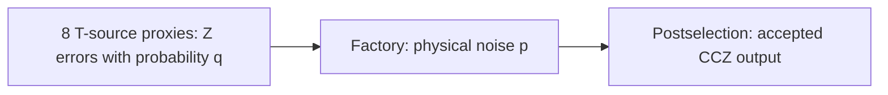

# 8T-1CCZ Distillation Factory

This tutorial compiles two 8T-1CCZ factory layouts and compares their simulated
outputs. Each factory consumes eight T states to prepare a three-qubit CCZ state.

## Load and compile the layouts

| Layout | Gallery entry | Purpose |
| --- | --- | --- |
| Conventional | `CCZ_4X3X6` | Baseline lattice-surgery factory |
| TELS | `CCZ_4X3X7_TELS` | Temporally encoded lattice-surgery variant |

```python
import bloq

factories = {
    "non-tels": bloq.GalleryItem.CCZ_4X3X6,
    "tels": bloq.GalleryItem.CCZ_4X3X7_TELS,
}
for name, entry in factories.items():
    graph = entry.load()
    graph.save(f"{name}.blog")
    program = bloq.compile(graph, distance=3)
    program.save(f"{name}.bloqir")
```

::::{md-tab-set}
:::{md-tab-item} Conventional
```{bloq-view} ccz_4x3x6
```
:::
:::{md-tab-item} TELS
```{bloq-view} ccz_4x3x7_tels
```
:::
::::

| Layout | Rounds per lattice-surgery measurement | Postselection |
| --- | --- | --- |
| Conventional | $d$ | Reject odd final X-type parity |
| TELS | $\lceil2d/3\rceil$ | Also check an even-parity relation among five Z-type readouts, replacing four independent readouts |

## Error Contribution

The factory has two error sources: independent logical Z errors of probability
$q$ on its eight [T-source proxies](t-gate.md#t-source-proxy), and physical
circuit noise of strength $p$. Measure accepted-output infidelity relative to
$\mathrm{CCZ}|+++\rangle$.



| Run | Parameters | Measures |
| --- | --- | --- |
| Circuit-only | $p>0$, $q=0$ | Circuit error $C(d)$ with perfect T inputs |
| Source-only | $p=0$, $q>0$ | Output error $S(q)$ from faulty T inputs |
| Mixed | $p>0$, $q>0$ | Combined error, including interactions |

With $p=0$, single input faults are rejected, but pairs can cause output errors.
The $\binom{8}{2}=28$ pairs give $S(q)\approx28q^2$ for small $q$.

The ideal model accepts even numbers of faulty inputs. Its acceptance $g_s(q)$
and accepted-output infidelity $S(q)$ are

$$
g_s(q)=\frac{1+(1-2q)^8}{2},\qquad
S(q)=\frac{28q^2(1-q)^6+56q^4(1-q)^4+28q^6(1-q)^2}{g_s(q)}.
$$

Compare the mixed results with $C(d)+S(q)$. This approximation can miss
interactions between source and circuit errors.

## Simulation

The script samples all sixteen measurement paths and uses offline decoding and
[postselection](t-gate.md#offline-decoding-and-path-based-postselection) to score
both factories.

Download {download}`the script <../examples/tutorial_ccz_simulation.py>` and
{download}`the circuit bundle <../assets/experiments/ccz-circuits.zip>`
into the same directory. Use Python 3.12 or newer:

```sh
uv add "clifft==0.6.0" "pymatching>=2.4,<3" "stim>=1.16,<2"
uv run python tutorial_ccz_simulation.py
```

The bundled circuits use distance 9 and $p=0.001$. The default samples 1,000
attempts per path. Increase `--shots` to resolve rare errors, and use `--q` to
select T-source error probabilities. Counts and results are saved to
`ccz-results.jsonl`.

```{literalinclude} ../examples/tutorial_ccz_simulation.py
:language: python
```

## Simulation Results

The plots compare factory infidelity and discard probability at $p=0.001$.
Discards exclude upstream T-state preparation failures.

```{figure} ../assets/experiments/ccz-factory-response.svg
:alt: CCZ factory response to input T infidelity for conventional and TELS layouts.
```

The circuit-only floors below use all sixteen paths. Uncertainties are nominal
pointwise 95% half-widths.

| Distance | Conventional floor | TELS floor |
| --- | ---: | ---: |
| 9 | $(3.500 \pm 0.257)\times10^{-4}$ | $(2.922 \pm 0.237)\times10^{-4}$ |
| 11 | $(5.202 \pm 0.364)\times10^{-5}$ | $(3.723 \pm 0.309)\times10^{-5}$ |
| 13 | $(7.251 \pm 0.809)\times10^{-6}$ | $(5.854 \pm 0.598)\times10^{-6}$ |
| 15 | $(0.853 \pm 0.278)\times10^{-6}$ | $(1.037 \pm 0.304)\times10^{-6}$ |
